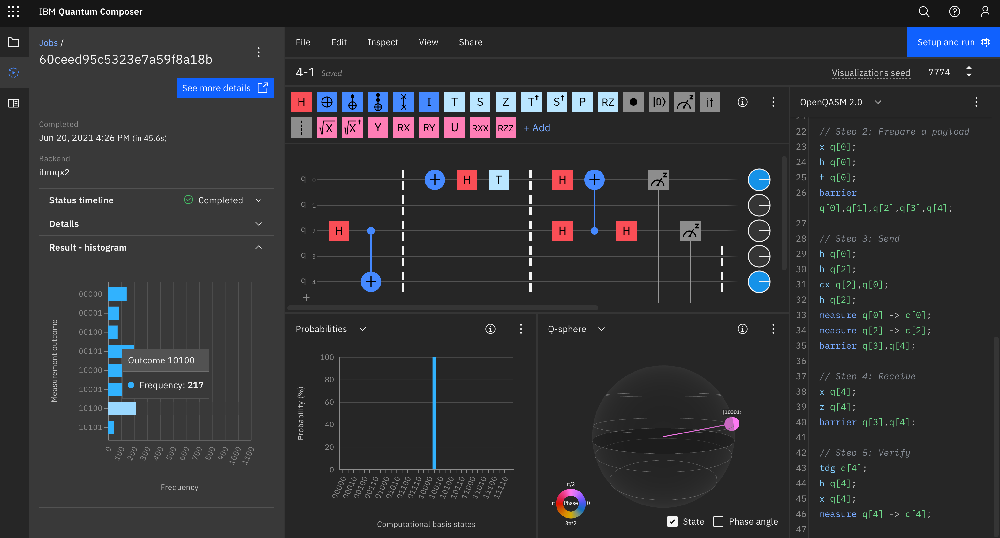

# 4章 量子テレポーテーション

## 4.1

- <https://oreilly-qc.github.io/?p=4-1> を IBM Q で実行すると量子テレポーテーションを行えてパイオニアになれる！
- IBM QX での実行結果の例 (Yorktown を選ぶと早く実行される模様。Manilla では全然始まらなかった。)  
  
- 図4-1 で配線がやたらうねうねしているのはなぜ？  
  また、 0-4 や 1-3 などが直接つながっていないのはなぜ？
- ep は entangled pair と思われる
- p.71 の日本語がとても分かりにくい。4章全部を読んでから読むと意味が分かる。
  - 1段落目の最後の方は、アリスが READ した Alice と ep の値を Ethernet などでボブに送り、 ボブはその情報を使って Bob が4つの状態のうちどれだったかを復元できる、ということを言っている。
  - 2段落目は、古典的に情報を送っていてすごくないと思われるかもしれないが、 Alice から Bob に量子状態を送るのは古典的には実現できないのですごい、と言っている。補助的に送っている2個の古典ビットが持つ情報よりも多い情報を送ることができている。

## 4.2

- ブラウザ上で円表示を2行でいい感じに表示するには円を拡大したりする。
- 4.2 では <https://oreilly-qc.github.io/?p=4-1> の QCEngine のプログラムで  
  ```javascript
  var bob_is_asleep = true;
  ```
  とした場合であることに注意。この場合、ボブが寝ているため、アリスからイーサネット経由で古典ビットを送ることはない (IBM QX が feed forward に対応していないためそれに合わせている)。そのため、recieve の部分で `NOT` と `PHASE(180)` は必ず実行される。
- p. 77 のステップ4で「HADまたはPHASE(180)」とあるのは、「NOTまたはPHASE(180)」の誤り。p.80 の「HADとPHASE(180)」も同様。
- ステップ5 (verify) で、prep payload の逆演算を行うとシミュレータでは必ず bob=0 となる。実機ではエラーが起こる可能性がある。

## 4.3

- 本では成功率 87.8% となっているが、自分で実行した結果は上記の Yorktown 画像のようにもう少し低かった。
- また Melbourne で実行するとエラーは50%以上...!  
  

## 4.4

- テレポーテーションが基本的なものということなので、上記の成功率 88% はかなり低いと感じる

## 4.5

- <https://oreilly-qc.github.io/?p=4-2>
- ハエの絵をうまく表示するにはまず円表示の円の中身を大きくして(右端の緑の円を何回かクリックする)、円表示の canvas 要素やその親の div 要素の height を500に変えてやると良い。  
  それにはブラウザの開発者ツールを開いて、コンソール内で次を実行する。(もしくは、ブックマークレットに設定してもよい)  
  
  ```javascript
  document.getElementById("circle_div").style.height='500px';
  document.getElementById("circle_canvas").height=500;
  ```
  
  ブックマークレットにする場合は、
  
  ```javascript
  javascript:document.getElementById("circle_div").style.height='500px';document.getElementById("circle_canvas").height=500;
  ```
 
- エラー率12%の場合のハエ  
  
- エラー率50%の場合のハエ  
  
