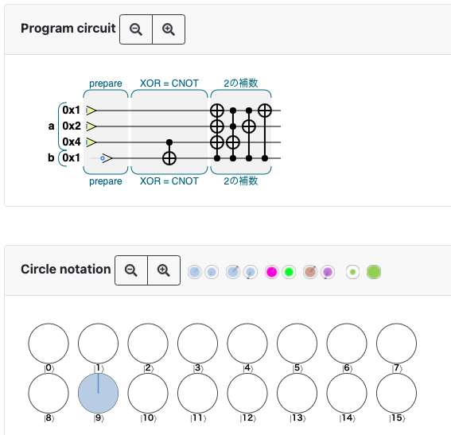
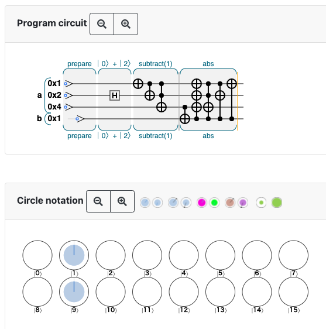

# 5章 量子算術演算と量子論理演算

## 5.1

- 復習
  - CCNOT = Toffoli gate
  - qubit はコピーできない
  - READ 以外の基本的な QPU 演算は可逆 (WRITE は READ + NOT でできる -> 2.3.4)
  - 演算が可逆なのはユニタリだから？

## 5.2

- 量子ニブル (qunible) を使った算術演算を考える

### 5.2.1

- increment と decriment <https://oreilly-qc.github.io/?p=5-1>
- これらは普通の整数と量子整数の足し算になっている

## 5.3

- 「複製不可能性に違反する」の説明は「可逆性の要件に違反する」の偽の命題を仮定していておかしい？ 演算がユニタリであることから可逆的であることが言えて、複製不可能性はそこから導かれるという方が自然？
- +演算子は可逆性と複製不可能性に反するので += 演算子を実装する  
  <https://oreilly-qc.github.io/?p=5-2>
- QCEngine で add が実装されているのはこのあたり -> [QCEngine/qcengine_int.js at master · machinelevel/QCEngine](https://github.com/machinelevel/QCEngine/blob/master/src/qcengine_int.js#L1162)

## 5.4

- [補数（complement）とは - IT用語辞典 e-Words](https://e-words.jp/w/%E8%A3%9C%E6%95%B0.html)
- 実は C++ で負の整数を2の補数で表すことが仕様で定められたのは C++20 ! ([符号付き整数型が2の補数表現であることを規定 - cpprefjp C++日本語リファレンス](https://cpprefjp.github.io/lang/cpp20/signed_integers_are_twos_complement.html))

## 5.5

- 乗算は可逆にするのが困難
- 可逆な演算の例: 二乗してから足す <https://oreilly-qc.github.io/?p=5-3>
- `b <- b*b` は不可逆だが、 `a += b*b` の逆演算は `a -= b*b` で、可逆
- 図5-10 は、以下のように理解できる。  
  \\(b = b_1 + 2b_2\\) とおくと (\\(b\\)を2進数で表したときの1桁目を\\(b_1\\)、2桁目を\\(b_2\\))、  
  \\[
      b^2 = {b_1}^2 + 4{b_1}{b_2} + 4{b_2}^2 \\\\
          = {b_1} + 4{b_1}{b_2} + 4{b_2}
  \\]  
  (0と1は2乗しても変わらないため、\\({b_1}^2 = b_1, {b_2}^2 = b_2 \\) )  
  図5-10の最初の４つの演算は \\(+=b_1\\) を表す。次の4つは \\(+=2b_1b_2\\) を2回やっている (\\(b_1b_2\\)は\\(b_1, b_2\\)がそれぞれ0または1であることから\\(b_1~\text{AND} b_2~\\)と同じ)。最後の2つが\\(+=4b_2\\)に対応。

(ここまで 2021/07/3)

## 5.6

### 5.6.1

- <https://oreilly-qc.github.io/?p=5-4>  
  3より上か下かを判定するために、-3して符号のビットで判定している

### 5.6.2

- <https://oreilly-qc.github.io/?p=5-5>
- 位相に情報をエンコードするのに CPHASE や CZ を使っている
- 書籍中の JavaScript 中の `b.not(~1)` のような部分が一見分かりにくい。まず `~1` は、1のビット演算の NOT、 つまり 32bit だったら一番下だけ0で、それ以外の31桁すべてが1になっている数を表す。なので、`b.not(~1)` は `b.not(1...10)` のようなイメージ。つまりレジスタ b に対して QPU の NOT 演算を、1つ目の qubit 以外全てに適用するという操作。  
  今の場合、bは二桁しかないので、`~1` は `10` と等価。

## 5.7

- abs の実装例はないようなので自分たちでやってみた。
  - -1 (0b111) にabsを適用する場合。

    ```javascript
    // Initialize
    var num_qubits = 4;
    qc.reset(num_qubits);
    var a = qint.new(3, 'a');
    var b = qint.new(1, 'b');
    // prepare
    qc.label('prepare');
    a.write(0b111);
    b.write(0b0);
    
    qc.nop();
    
    qc.label('XOR = CNOT');
    qc.nop();
    qc.nop();
    qc.cnot(0x8, 0x4);
    qc.nop();
    qc.nop();
    
    qc.label('2の補数');
    qc.cnot(0x1|0x2|0x4, 0x8);
    qc.cnot(0x4, 0x1|0x2|0x8);
    qc.cnot(0x2, 0x1|0x8);
    qc.cnot(0x1, 0x8);
    ```

    初期状態が \\(\ket{a =  -1 = \textrm{0b111},~b=0=\textrm{0b0}} = \ket{0111} = \ket{7} \\) で、終状態が \\(\ket{a = 1 = \textrm{0b001},~b=1=\textrm{0b1}} = \ket{1001} = \ket{9} \\) となっている。

    

  - 1と-1の重ね合わせにabsを適用する場合。  

    ```javascript
    var num_qubits = 4;
    qc.reset(num_qubits);
    var a = qint.new(3, 'a');
    var b = qint.new(1, 'b');
    // prepare
    qc.label('prepare');
    a.write(0);
    b.write(0);
    qc.nop();
    qc.label('｜0〉+｜2〉');
    qc.nop();
    qc.had(0x2);
    qc.nop();
    qc.label('subtract(1)');
    a.subtract(1);
    qc.nop();
    
    qc.label('abs');
    
    qc.cnot(0x8, 0x4);
    
    qc.cnot(0x1|0x2|0x4, 0x8);
    qc.cnot(0x4, 0x1|0x2|0x8);
    qc.cnot(0x2, 0x1|0x8);
    qc.cnot(0x1, 0x8);
    ```

    はじめに \\(\ket{0}\\) と \\(\ket{2}\\) の重ね合わせを作ってから \\(-1\\) すると \\(\ket{-1} = \ket{7}\\) と \\(\ket{1}\\) の重ね合わせになる。これに abs を適用すると \\(\ket{1}=\ket{0001}\\) と \\(\ket{9}=\ket{1001}\\) の重ね合わせになる。このとき、 \\(a\\) に対応する部分はどちらの状態でも \\(001\\) で、絶対値は等しい。 (-1と1の重ね合わせを作る方法を思いついたふぇるみうむ氏かしこい！)

    

(ここまで 2021/07/25)

## 5.8

- スクラッチキュビットは演算を可逆にするために導入したが、もつれやすい
- もつれを戻すために演算を巻き戻すことをアンコンピュートと呼ぶ
- アンコンピュートする前に値を足したり XOR (CNOT) したり、位相情報に変換するなどして計算結果を保存する

## 5.9

- NAND ゲートがあると、 AND, OR, NOT, XOR などが作れる
- CNOT ゲート (トフォリゲート) で NAND と同じものを作れる
  <https://oreilly-qc.github.io/?p=5-6>
- 他にも NOT, AND, NAND, XOR, OR, NOR を作ったものが図5-25

## 5.10

この章では重ね合わせ状態で計算する方法を見て来たが、次の章では結果を読み出す方法 (振幅増幅) を見て行く。
