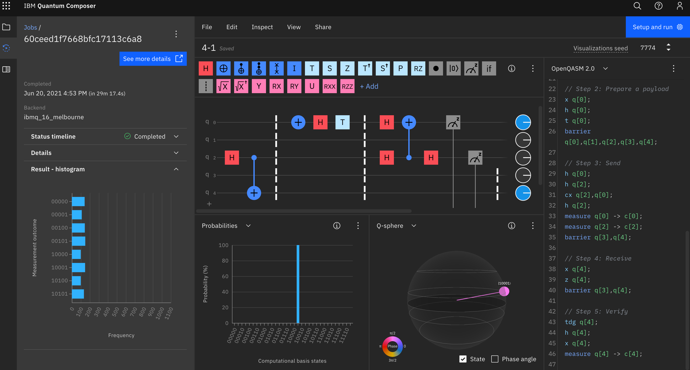
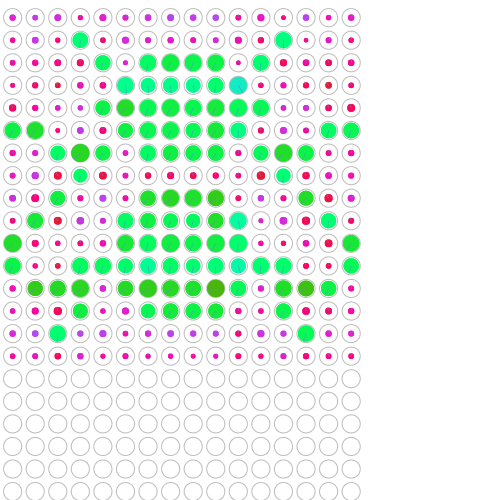
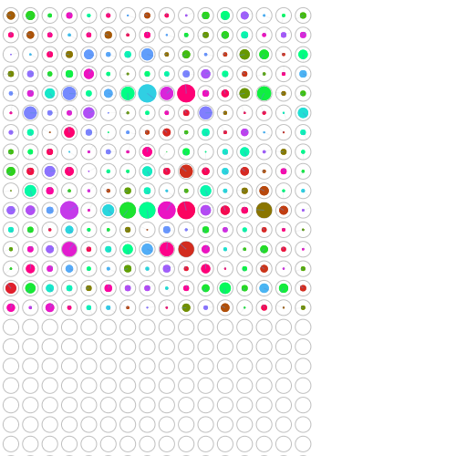

# 5章 量子算術演算と量子論理演算

## 5.1

- 復習
  - CCNOT = Toffoli gate
  - qubit はコピーできない
  - READ 以外の基本的な QPU 演算は可逆

## 5.2

- 量子ニブル (qunible) を使った算術演算を考える

### 5.2.1

- increment と decriment <https://oreilly-qc.github.io/?p=5-1>
- これらは普通の整数と量子整数の足し算になっている

## 5.3

- +演算子は可逆性と複製不可能性に反するので += 演算子を実装する  
  <https://oreilly-qc.github.io/?p=5-2>

## 5.4

- [補数（complement）とは - IT用語辞典 e-Words](https://e-words.jp/w/%E8%A3%9C%E6%95%B0.html)

## 5.5

- 乗算は可逆にするのが困難
- 可逆な演算の例: 二乗してから足す <https://oreilly-qc.github.io/?p=5-3>
- `b <- b*b` は不可逆だが、 `a += b*b` の逆演算は `a -= b*b` で、可逆


- ブラウザ上で円表示を2行でいい感じに表示するには円を拡大したりする。
- 4.2 では <https://oreilly-qc.github.io/?p=4-1> の QCEngine のプログラムで  
  ```javascript
  var bob_is_asleep = true;
  ```
  とした場合であることに注意。この場合、ボブが寝ているため、アリスからイーサネット経由で古典ビットを送ることはない (IBM QX が feed forward に対応していないためそれに合わせている)。そのため、recieve の部分で `NOT` と `PHASE(180)` は必ず実行される。
- p. 77 のステップ4で「HADまたはPHASE(180)」とあるのは、「NOTまたはPHASE(180)」の誤り。p.80 の「HADとPHASE(180)」も同様。
- ステップ5 (verify) で、prep payload の逆演算を行うとシミュレータでは必ず bob=0 となる。実機ではエラーが起こる可能性がある。

## 4.3

- 本では成功率 87.8% となっているが、自分で実行した結果は上記の Yorktown 画像のようにもう少し低かった。
- また Melbourne で実行するとエラーは50%以上...!  
  

## 4.4

- テレポーテーションが基本的なものということなので、上記の成功率 88% はかなり低いと感じる

## 4.5

- <https://oreilly-qc.github.io/?p=4-2>
- ハエの絵をうまく表示するにはまず円表示の円の中身を大きくして(右端の緑の円を何回かクリックする)、円表示の canvas 要素やその親の div 要素の height を500に変えてやると良い。  
  それにはブラウザの開発者ツールを開いて、コンソール内で次を実行する。(もしくは、ブックマークレットに設定してもよい)  
  
  ```javascript
  document.getElementById("circle_div").style.height='500px';
  document.getElementById("circle_canvas").height=500;
  ```
- エラー率12%の場合のハエ  
  
- エラー率50%の場合のハエ  
  
