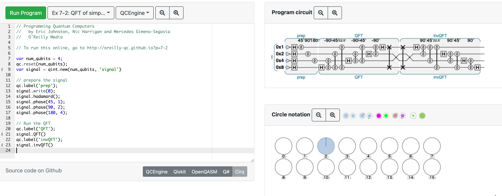

# 7章 QFT:量子フーリエ変換

## 7.1

- <https://oreilly-qc.github.io/?p=7-1>

## 7.2

- ふぇるみうむ氏おすすめのフーリエ変換の資料 → [やる夫で学ぶディジタル信号処理](http://www.ic.is.tohoku.ac.jp/~swk/lecture/yaruodsp/main.html)

## 7.3

- <https://oreilly-qc.github.io/?p=7-2>
- QFT は可逆なので in-place で実行できる。逆変換は `invQFT` でできた ([7.5.1.2](#7512)で出てきた)。  
  
- <https://oreilly-qc.github.io/?p=7-3> は 7-2 と一緒。

## 7.4

- 8バイト = 64ビット = 倍精度浮動小数点数 だけど、普通ビットで表すことが多い気がするので一瞬戸惑った
- 入力状態が実数だと mirror image が現れる
  - [numpy.fft.fft](https://numpy.org/doc/stable/reference/generated/numpy.fft.fft.html) などで動かして挙動を理解するのが良さそう
- <https://oreilly-qc.github.io/?p=7-5> は [4.5](chap4.html#45) に書いたブックマークレットを使うときれいに見える。

## 7.5

### 7.5.1

- FFT の計算量は \\(\mathcal{O}(N \log N) \\) (\\(N\\)は標本数) なので、\\(N = 2 ^n\\) を代入すると \\(\mathcal{O}(n2^n) \\)
- QFT の場合は \\(\mathcal{O}(m^2) \\) から逆算すると恐らく計算量は \\(\mathcal{O}((\log N)^2) \\)？
- QFT の場合、周波数分布を得るには READ を何度も行わないといけなくて、その回数のオーダーは \\(\mathcal{O}(2^m) \\) とかになりそう？

#### 7.5.1.1

- 一般に入力信号を QPU レジスタに載せるのは簡単ではない
  - 計算量が必要な場合もあるので、 QFT による高速化がキャンセルしてしまう可能性もある
- QFT の結果にアクセスするのが困難
  - 結果の一部だけ見るだけで良いアプリケーションとかになら使える
- ショアの因数分解アルゴリズムでは QFT が使われている

#### 7.5.1.2

- 逆QFT <https://oreilly-qc.github.io/?p=7-6>
  - レジスタ準備するときにも使えそう
- 周波数変調 <https://oreilly-qc.github.io/?p=7-7>
  - QFT → 値を足す → invQFT で周波数変調できる

(ここまで 2021/09/04)

## 参考になりそうな記事

- [量子フーリエ変換 自分用まとめ - Qiita](https://qiita.com/N-H-Shimada/items/335580d208b6126f4c88)
