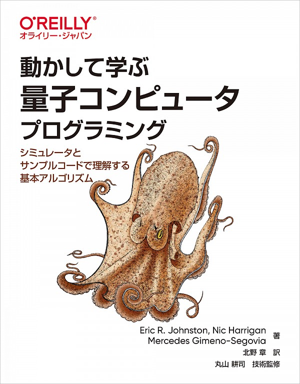

# 『動かして学ぶ量子コンピュータプログラミング』 (タコ本) のやっていき記録

- [紙版 (Amazon)](https://amzn.to/3vxtf0o) / [PDF版 (O'reilly)](https://www.oreilly.co.jp/books/9784873119199/)
- [版元ドットコム](https://www.hanmoto.com/bd/isbn/9784873119199)

    

このページは [mdBook](https://rust-lang.github.io/mdBook/) で作っています。ソースコードは以下にあります。  
<https://github.com/pn11/octo-book>
